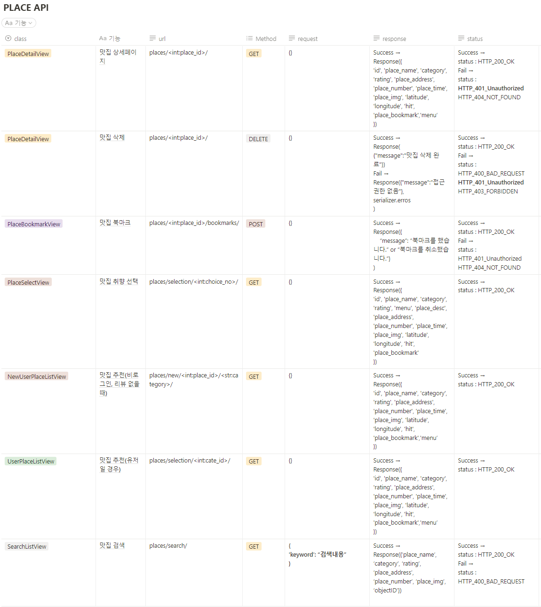

# 🍽가까?마까?(GaggaMagga) 프로젝트 

 

**프로젝트 기간** : 2022.11.30 ~ 2022.12.29
 
  
[🔗 가까 마까 서비스 둘러보기](http://gaggamagga.shop/)
 

 

## ****✨ 프로젝트 소개****

**기획 의도**
- 누구나 여행을 떠나서 음식점을 가거나, 점심 식사 메뉴를 정할 때 고민이 있었던 경험이 있을 것 입니다.
- 본 서비스는 '제주도' 라는 특정 지역에서 먹고자 하는 음식의 종류나 장소를 선택하면 사용자에게 **맛집을 추천**하고 있습니다.
- **추천 기능**은 머신러닝 유저기반 추천 기능을 활용하여 사용자와 가장 **유사한 경험**을 갖고 있는 사용자의 데이터들를 통해 음식점을 **추천**합니다.
- 방문한 맛집은 다른 사용자와 후기를 **공유**하고, 후기에는 별점을 넣어 **장소별 평가점수를 관리**할 수 있습니다.
- 각 후기에는 댓글과 대댓글 기능으로 **유저간 경험을 공유할 수 있는 플랫폼을 제공**합니다.
- 마음에 드는 장소는 북마크하여 저장하고, 성향이 잘 맞는 유저는 팔로우하여 해당 **유저의 경험을 공유**받을 수 있는 서비스를 구성하였습니다.

**Back-end Link**
 
[📥 Back-end Repository](https://github.com/woong-garden/GaGgaMaGga_BE)
 

**프로젝트 문서**
 
[📚 Notion 현황판 & 트러블 슈팅](https://liberating-engineer-32d.notion.site/11-30-12-29-482dc47b71d44e968cf32283bb422238)

 

## 🥘 ****서비스 시연 영상****

 

 

## 📃****기능 명세서****
  - 온보딩을 활용하여 사용자가 웹사이트를 접속했을 때 어떤 서비스를 제공하는지 간단하게 설명해줌
  - 사용자 환경(회원가입, 로그인, 회원정보 관리, 팔로우, 비활성화, 아이디/비밀번호 찾기 등등)
  - 맛집 후기(리뷰) 작성/수정/삭제, 조회수 카운트, 좋아요, 검색 기능  
  - 후기 댓글 작성/수정/삭제
  - 후기 댓글의 대댓글 작성/수정/삭제 기능
  - 유저간 댓글 알림 기능

 

## 🔨 ****개발 포지션 구성****
  
  

    
🛠 사재혁(팀장)

    

  
  - 유저 관리, 프로필, 개인설정 및 추가 기능
  - user 테스트 코드
  - Docker, AWS 배포
  - CI/CD 구축
  - 코드 리팩토링/Swagger 적용

  

  
   

    
🛠 장진

    

  
  - 머신러닝 장소 추천 기능, 후기 조회수, 페이지네이션
  - place 테스트 코드
  - CI/CD 구축

  

  
  

  
🛠 나웅주

  

  
  - 리뷰 조회 페이지, Best 리뷰 페이지 
  - 전체적인 Font-End 수정
  
  

  

  
🛠 이지영

  

  
  - 북마크 기능, 좋아요 기능, 댓글/대댓글 기능 
  - review 테스트 코드

  

  
  

  
🛠 이금빈

  

  
  - 리뷰 생성 페이지, 팔로우 기능, 알림 기능, 검색 기능
  - notification 테스트 코드
  - Docker, AWS 배포

  

 

## ****💻 기술 스택****  

### Frontend :    
### Server :       
### Management :   
### Database : 

 

## 📚 ****Used API, Dataset****
  - **소셜로그인** : KAKAO Oauth2 API
  - **계정 찾기** : NAVER Cloud SMS API
  - **지도 App** : NAVER Web Dynamic Map API
  - **검색 App** : ALGOLIA API
  - **IP 정보 확인** : Whois API
  - **맛집 Data** : NAVER Map v5.0 crawling Data
  

 

## 🧱 ****Project Architecture****

 

## 🕸 ****[Wireframe](https://www.figma.com/file/dlmax1N0WmxIWkeoxWMWCs/%EC%B5%9C%EC%A2%85-%ED%94%84%EB%A1%9C%EC%A0%9D%ED%8A%B8?node-id=0%3A1&t=0TMnEGrfJz1zCmk7-0)****

 

## 🛢 ****[Database ERD](https://www.erdcloud.com/d/RvXb4PCLq3t3CPb3e)****

 

## 🎯 ****Notion API**** | ****[Swagger API Docs](https://www.gaggamagga.tk)****

USER API

PLACE API

REVIEW API
 

NOTIFICATION API

 

 

